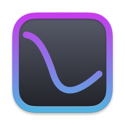
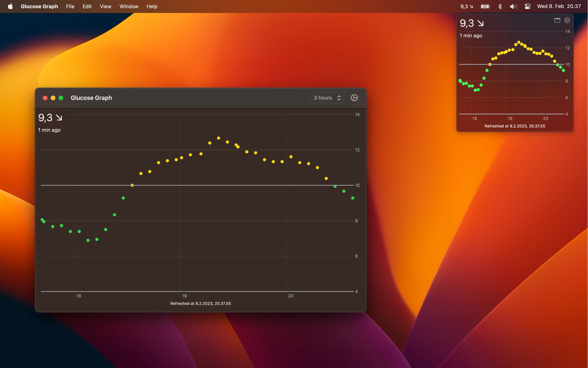

<header class="flex flex-col items-center text-center">
  
  <h1 class="mt-4">Glucose Graph</h1>
  
Your blood glucose right on the menu bar.

</header>

A simple app to keep on track of your sugars if you have a continuous glucose monitor. It connects to a
<a target="_blank" href="https://nightscout.github.io/">Nightscout</a>
server and shows the latest value on the menu bar. You can see the
recent history from the graph.

My playground for learning some SwiftUI and macOS development.

I can't promise any support for the app but please [contact me](/about) if you have any feedback!
