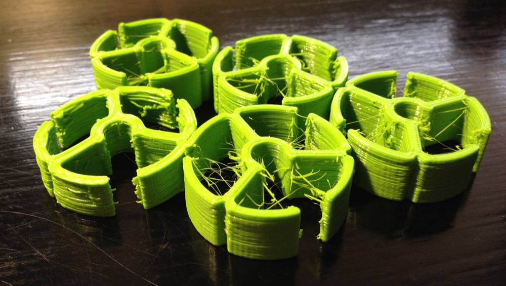
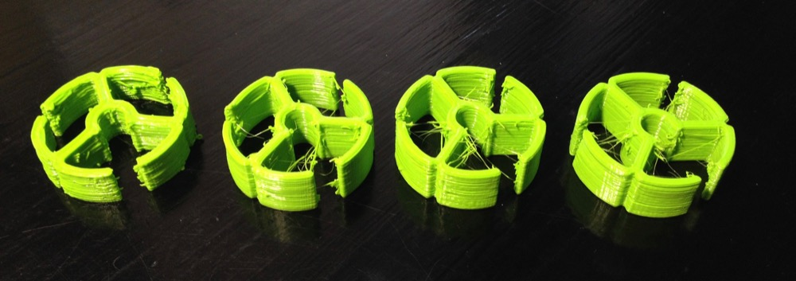
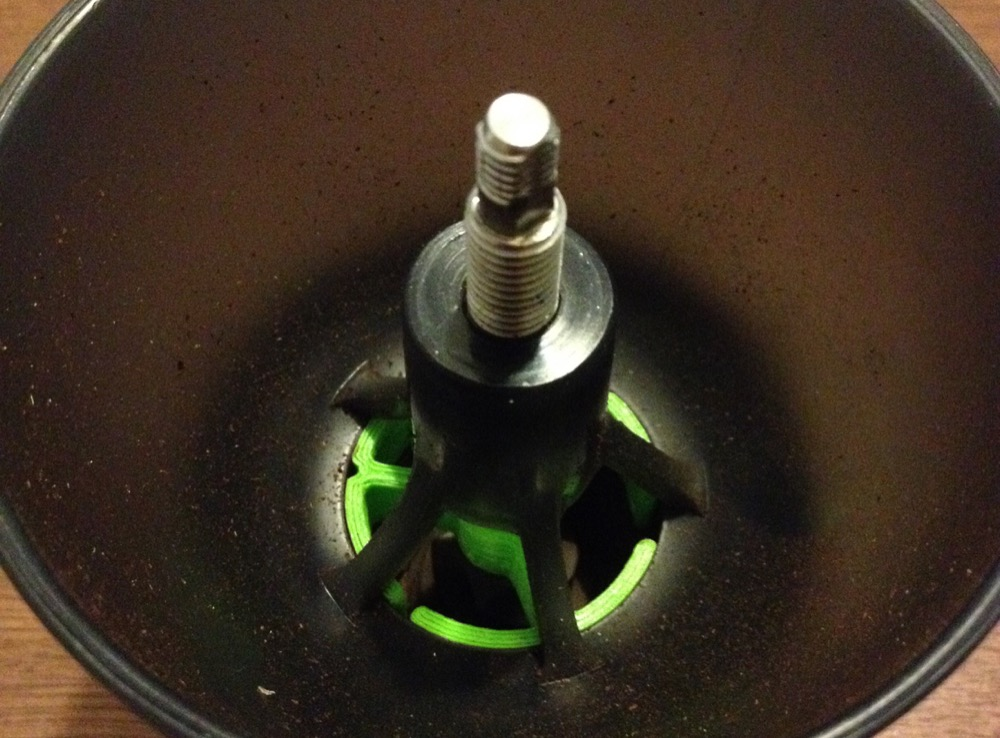

**Update:** Hello from 2024! After 7 years the original post has been removed from Reddit. [You can download my fixed STL file here](/downloads/hario-lower-bearing.stl). My Hario Skerton has not been in daily use for some time now, but the printed bearing has hold up well.

I am a coffee person. I enjoy good coffee and I do things for it. Today I 3D printed a bearing for my coffee grinder Hario Skerton in order to produce more consistent grind.

I have access to my school's printer (MakerFarm 6" Prusa i3). I had printed once before this. I used [Repetier Host](http://www.repetier.com) with [Slic3r](http://slic3r.org).

The model I got from [this Reddit thread](https://www.reddit.com/r/Coffee/comments/2s016o/got_tired_of_my_harios_inconsistent_grind_so_i_3d/). There is STL and Solidworks files available. I had to fix the STL file with Slic3r (it was non-manifold) before Repetier Host accepted it.

First print was not good. The walls were very coarse and ugly. I stopped printing and sliced again with smaller extrusion multiplier (from 1.2 to 1.05) and lower extrusion temperature (205 -> 200 °C). The result was much better, though the walls were melting and falling inwards.

The third one I got right. I increased layer height to 0.4 mm and the result was good.

_First print on the left_

At first the bearing was a bit too tight when installed on place. After a little sanding, the fit was perfect.

_The bearing installed_

> So, how is the grind?

I haven't done any actual comparing tests but there is notably less wobble in the grinder. I was happy with the grind without the bearing, I just thought this was a cool project to do! :)
