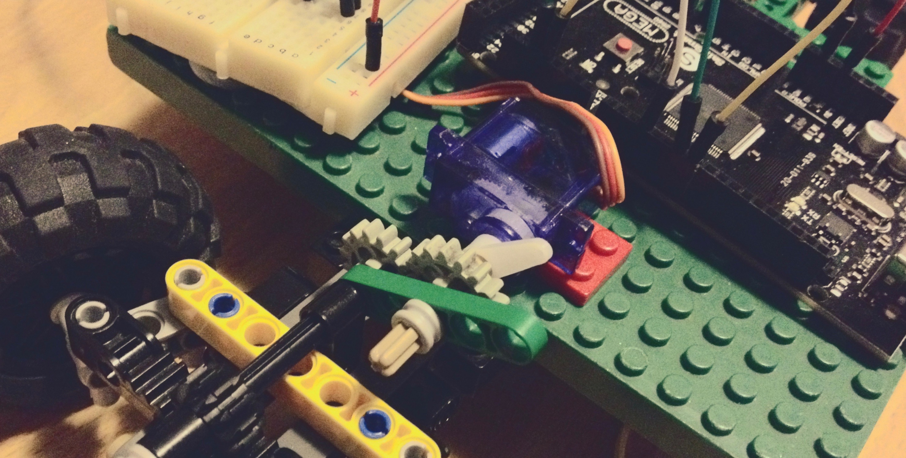
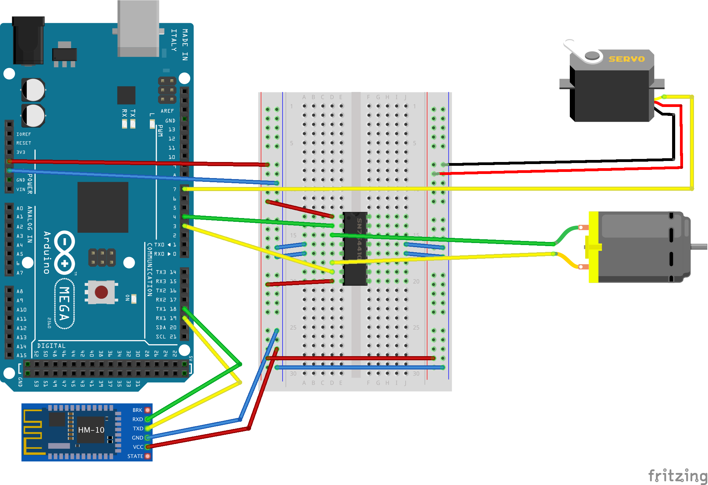
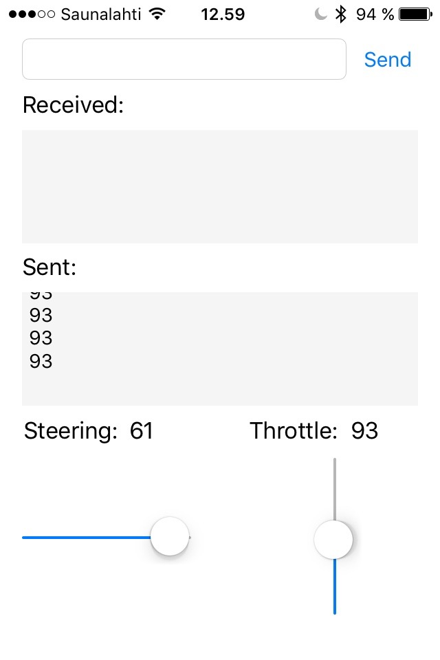

**I made this project during christmas break from school. The goal was to test my Arduino components, try something new with iOS and build something amazing.**

_You can get all the code and Fritzing scetch from the [git repository](https://github.com/stami/BLErduino)._

## Used Components

- Arduino Mega 2560
- HM-10 Bluetooth LE chip
- DC motor
- Servo motor
- Small breakout board
- H-bridge SN754410

I used some old Legos to build the car's frame. I also used Lego DC motor. I hot glued my servo on a lego brick to get it on my car.

## Wiring

I connected my BLE module to Arduino Mega's Serial1 (RX1 19, TX1 18) pins.
Note that BLE's RX goes to Arduino's TX and vice versa.

I was feeling lazy and my motors were small, so I took the power for motors straight from Arduino's 5 V pin. For serious implementation, one should get external power for H-bridge.



## Protocol design

I used serial communication between Arduino and iPhone.
After trying and erroring, I managed to figure out how to send an 8-bit integer from iOS to Arduino.
In order to simplify the Arduino code, I used those 8 bits for all my purposes.

Unsigned 8 bit integer can hold numbers between 0 and 127.
I reserved the first half (0 - 63) for steering.
The other half (64-127) was reserved for throttling.

So, when Arduino received an number, I figured out if it was steering or throttling command and continued according to that.

## Arduino

I used Arduino's servo library for controlling the servo.
I also used Arduino's `analogWrite()`-function to set motor speed.
The code is simple and self-explanatory.

My `loop()` was simple:

```c
loop() {
  // read from Bluetooth serial
  if (Serial1.available()) {
    incomingByte = Serial1.read(); // Int8 received from iOS app

    // Dump to USB serial
    Serial.write("BLE: ");
    Serial.println(incomingByte);

    // The range 0...127 is divided between steering and throttling
    if (incomingByte < 64) {
      setSteering(incomingByte); // 0...63
    } else {
      setThrottle(incomingByte); // 64...127
    }
  }
}
```

Steering command even simpler. I used `map()` to scale the incoming value to my steering angle.

```c
/**
 * Set Steering
 * 0 <= incoming <= 63
 * Map the incoming value to the servo angle
 */
void setSteering(byte incoming) {
  // Map the value
  // Range of 30 - 150 to prevent my steering assembly from breaking
  int angle = map(incoming, 0, 63, 30, 150);
  servo.write(angle);
}
```

And then `setThrottle()`:

```c
/**
 * Set Throttle
 * 64 <= incoming <= 127
 * Lower:   < 95 => Reverse
 * Middle: == 95 => Stop
 * Upper:   > 95 => Forward
 */
void setThrottle(byte incoming) {
  int speed; // mapped value

  // Reverse
  if (incoming < 95) {
    // Map the value 64...94 to 0...255
    speed = map(incoming, 64, 94, 255, 0);
    analogWrite(motor2, speed);
    digitalWrite(motor1, LOW);
  }

  // Stop
  else if (incoming == 95) {
    digitalWrite(motor1, LOW);
    digitalWrite(motor2, LOW);
  }

  // Forward
  else {
    // Map the value 96...127 to 0...255
    speed = map(incoming, 95, 127, 0, 255);
    analogWrite(motor1, speed);
    digitalWrite(motor2, LOW);
  }
}
```

## iOS

First, I created the app's layout. I put sliders for steering and throttling.

I set the sliders so that they keep in the limits: 0-63 for steering and 64-127 for throttling. See the screenshot below.

<div>
  
</div>

I only have one Storyboard and one ViewController.
So, my ViewController starts like this. note the importing of `CoreBluetooth` and adopting `CBCentralManagerDelegate` and `CBPeripheralDelegate` protocols.

I found out the UUID's of my chip and hard coded them. As I have only one bluetooth chip, I don't need to be able to choose the device.

```swift
import UIKit
import CoreBluetooth

// Hard coded values for my BLE chip
let transferServiceUUID = CBUUID(string: "FFE0")
let transferCharacteristicUUID = CBUUID(string: "FFE1")

class ViewController: UIViewController, CBCentralManagerDelegate, CBPeripheralDelegate {
  ...
}
```

Here is my throttle slider. I rotated the slider to be vertical.
Then I just send the slider value to the Arduino when it has changed.
Steering slider was handled just the same way.

```swift
// Throttle
@IBOutlet weak var throttleSliderLabel: UILabel!
@IBOutlet weak var throttleSlider: UISlider! {
    didSet {
        // Rotate slider to be vertical
        throttleSlider.transform = CGAffineTransformMakeRotation(CGFloat(-M_PI_2))
    }
}
@IBAction func throttleSliderValueChanged(sender: UISlider) {

    let currentValue = Int(sender.value)
    throttleSliderLabel.text = "\(currentValue)"
    writeInt(currentValue)

}
```

In previous snippet, I used this `writeInt()` method.
It takes Swift's Int as a parameter, converts it to Int8, creates a NSData object from it and finally sends it to the peripheral device (my Arduino).

```swift
// Send 8-bit integer to the device
func writeInt(data: Int){

    var mutabledata = Int8(data)
    print("int8: \(mutabledata)")

    let data = NSData(bytes: &mutabledata, length: sizeof(Int8))

    if let peripheralDevice = discoveredPeripheral {
        if let deviceCharacteristics = discoveredCharacteristic {
            peripheralDevice.writeValue(data, forCharacteristic: deviceCharacteristics, type: CBCharacteristicWriteType.WithoutResponse)
        }
    }
}
```

The rest of the code is just copied from [Apple's sample](https://github.com/0x7fffffff/Core-Bluetooth-Transfer-Demo).

## All together

Here's some proof that it actually worked! It's beautiful, isn't it?
The thick wire from arduino is USB power cable connected to power bank.

<div class="youtube-video-container">
  <iframe src="https://www.youtube.com/embed/WMe2VWcVXyA" frameborder="0" allowfullscreen></iframe>
</div>

Video at Youtube: [https://www.youtube.com/watch?v=WMe2VWcVXyA](https://www.youtube.com/watch?v=WMe2VWcVXyA)
