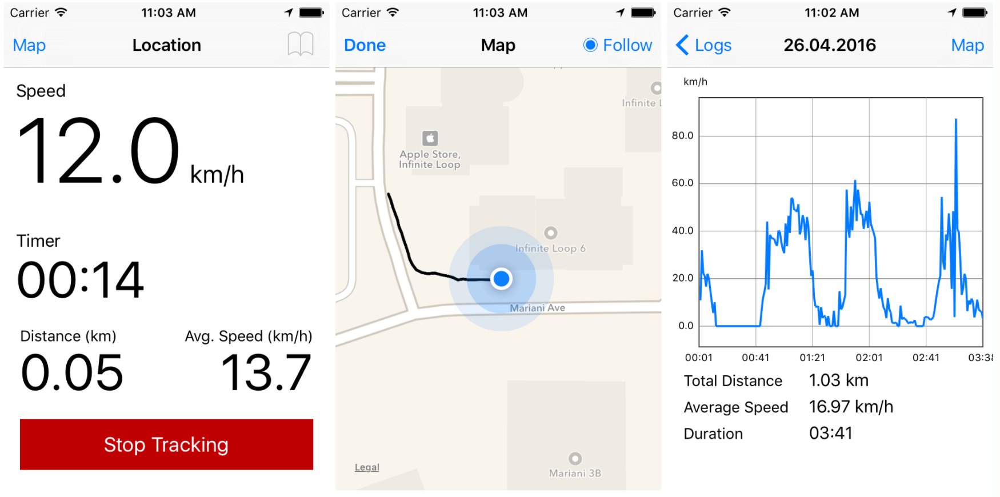
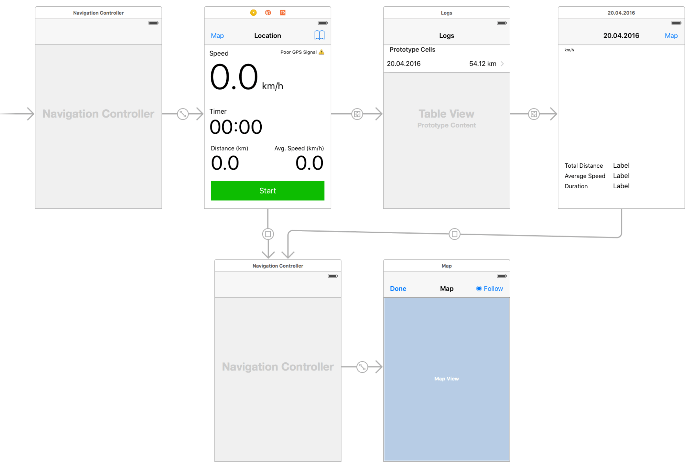

I had a mobile development course at my school Tampere University of Applied Sciences and I decided to build a [Sports Tracker](http://www.sports-tracker.com/) clone.

I had a lot of fun making it and learned a bit about [Core Location](https://developer.apple.com/reference/corelocation) and [MapKit](https://developer.apple.com/reference/mapkit). I also tried to apply some digital signal processing skills I learned during a DSP course, mainly just some average filtering of the exercise data for the chart.

Below the UI structure. There is the main view where one can start and stop the exercise and see the live stats. There is also a list of previous exercises and a detailed view of the exercise with interactive chart component. In the map view one can see the tracked GPS route.

Because of the course requirements, I had to use some backend service and so the app saves the exercises to [mLab's free MongoDB sandbox](http://docs.mlab.com/data-api/).

The project is open source under the – let's say [DBAD](http://www.dbad-license.org/) licence – and you can [get it from Github](https://github.com/stami/Location).
