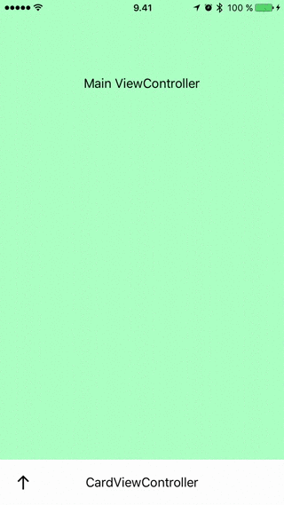

I've been watching WWCD 2017 videos lately and experiementing with the stuff. [Session 230 - Advanced Animations with UIKit](https://developer.apple.com/videos/play/wwdc2017/230/) was really interesting and I decided to play with the example they showed in the end of the session.

## TL;DR

[See the code on Github.](https://github.com/stami/CardDemo)



## Walkthrough

I created `CardViewController` with it's own `.xib` file for UI. I exposed the title bar and arrow symbol as `IBOutlet`s so that I had access to them in my main `ViewController`.

The animation logic is in the main `ViewController`.

Here I instantinate the card and add it as a child ViewController to the main ViewController. After that the CardViewController's view has to be added as subview.

```swift
cardViewController = CardViewController(nibName: "CardViewController", bundle: nil)

addChildViewController(cardViewController)
view.addSubview(cardViewController.view)

let cardFrame = CGRect(x: 0,
                        y: view.frame.height - cardTitleHeight,
                        width: view.bounds.width,
                        height: cardHeight)

cardViewController.view.frame = cardFrame
```

I created animation coordination logic like in the session. **Note that I added a completion block** to clear running animations after finishing the animation. It was _just assumed_ in the session example. :)

Here is the frame animation part.

```swift
// Perform all animations with animators if not already running
func animateTransitionIfNeeded(state: CardState, duration: TimeInterval) {
  if runningAnimations.isEmpty {

    let frameAnimator = UIViewPropertyAnimator(duration: duration, dampingRatio: 1) {
      switch state {
      case .expanded:
        self.cardViewController.view.frame.origin.y = self.view.frame.height - self.cardHeight
      case .collapsed:
        self.cardViewController.view.frame.origin.y = self.view.frame.height - self.cardTitleHeight
      }
    }

    // Clear animations when completed
    frameAnimator.addCompletion { _ in
      self.cardIsVisible = !self.cardIsVisible
      self.runningAnimations.removeAll()
    }

    frameAnimator.startAnimation()
    runningAnimations.append(frameAnimator)
  }
}
```

That together with tap gesture recognizer does the work for handling taps. Here's how I set the gesture recognizer:

```swift
let tapGestureRecognizer = UITapGestureRecognizer(target: self,
                                                  action: #selector(ViewController.handleCardTap))
cardViewController.titleBar.addGestureRecognizer(tapGestureRecognizer)
```

And here's the tap handler:

```swift
@objc
func handleCardTap(recognizer: UITapGestureRecognizer) {
  switch recognizer.state {
  case .ended:
    animateTransitionIfNeeded(state: nextState, duration: 0.3)
    break
  default: break
  }
}
```

I'm just calling the `animateTransitionIfNeeded` function.

**How about pan handler?**

I'll just throw the code for you. After the pan gesture has began, I'll start the animations and pause them instantly. That way they won't complete on their own but will follow the finger.

```swift
// Called on pan .began
func startInteractiveTransition(state: CardState, duration: TimeInterval) {
  if runningAnimations.isEmpty {
    animateTransitionIfNeeded(state: state, duration: duration)
  }
  for animator in runningAnimations {
    animator.pauseAnimation()
    animationProgressWhenInterrupted = animator.fractionComplete
  }
}

// Called on pan .changed
func updateInteractiveTransition(fractionComplete: CGFloat) {
  for animator in runningAnimations {
    animator.fractionComplete = fractionComplete + animationProgressWhenInterrupted
  }
}

// Called on pan .ended
func continueInteractiveTransition() {
  for animator in runningAnimations {
    animator.continueAnimation(withTimingParameters: nil, durationFactor: 0)
  }
}
```

Here's the pand handler which calls those functions:

```swift
@objc
func handleCardPan(recognizer: UIPanGestureRecognizer) {
  switch recognizer.state {

  case .began:
    startInteractiveTransition(state: nextState, duration: 0.3)

  case .changed:
    let translation = recognizer.translation(in: self.cardViewController.titleBar)
    var fractionComplete = translation.y / (cardHeight - cardTitleHeight)
    fractionComplete = cardIsVisible ? fractionComplete : -fractionComplete
    updateInteractiveTransition(fractionComplete: fractionComplete)

  case .ended:
    continueInteractiveTransition()
  default:
    break
  }
}
```

Maybe the most interesting part there is the `.changed` case. There I get the finger movement related to the card title and map that to the length of card's expected movement when it expands.

[See the whole code on Github.](https://github.com/stami/CardDemo)

Thanks for reading!
