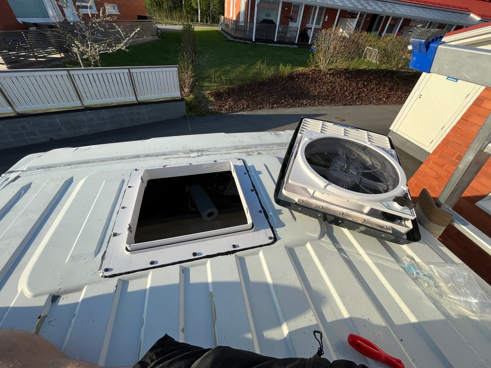
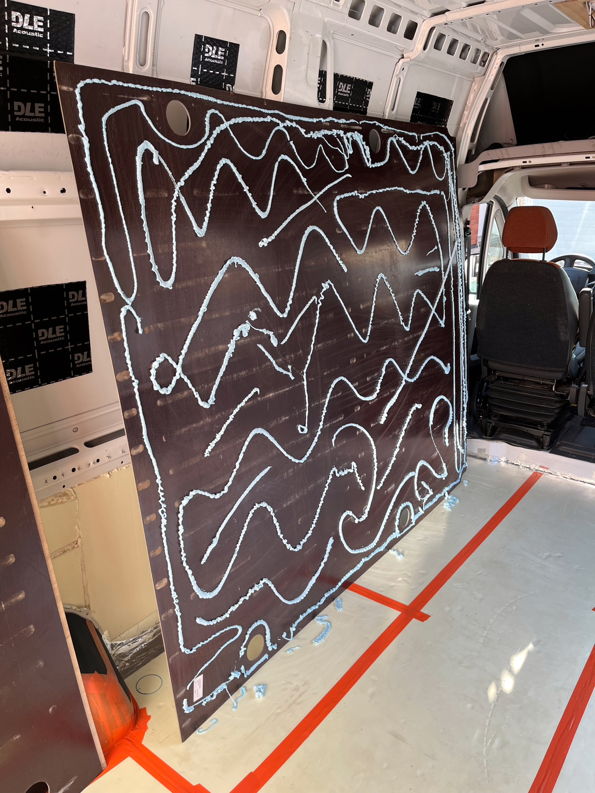
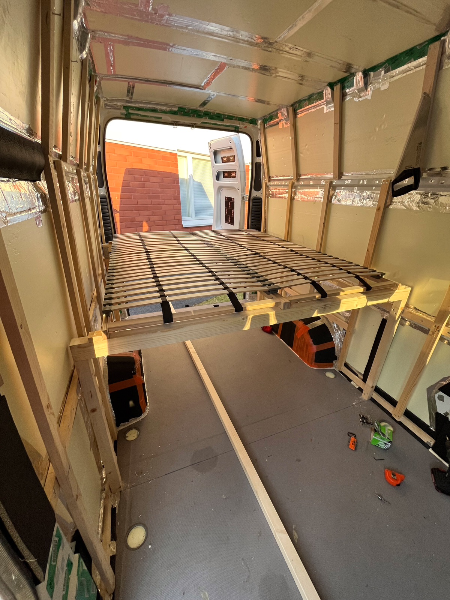

# Samulin pakuprojekti

[Aihio](#base) • [Suunnitelma](#plan) • [Purkaminen](#teardown) • [MaxxFan-kattoluukkutuuletin](#maxxfan) • [Pohjatyöt](#rust) • [Eristykset](#insulation) • [Ikkuna](#window) • [Sänky](#bed) • [Seinät](#walls) • [Keittiö](#kitchen) • [Sähköt](#electrics) • [Muutoskatsastus](#inspection)

<!-- MARK: Aihio
-->
<h2 id="base">Aihio</h2>

- Auto: Fiat Ducato L4H3 2011
- Ajettu 249 000 km
- Auto hankittiin syksyllä 2022 ja rakentaminen alkoi keväällä 2023.

<!-- MARK: Suunnitelma
-->
<h2 id="plan">Suunnitelma</h2>

Alustava suunnitelma oli seuraava:

- 200x140 cm (tai jopa 160) sänky pituussuunnassa
- Sängyn alle kaksi tilavaa häkkiä koirille
- Keittiö liukuoven puoleiselle seinälle
- Sohva toiselle puolelle
- Rimakatto, yleisvalaisu kahdella koko katon mittaisella ledinauhalla
- Vesisäiliö keittiön puoleiselle seinälle
- Akku ja muut sähkölaitteet vastaavasti toiselle seinustalle
- ~~Kaasupullokotelo lieden alle~~ -> Induktioliesi

  

    
  

  

    
  

Ja tarkoitus oli tarkentaa sitä mukaa kun homma edistyy.

<!-- MARK: Purkaminen
-->
<h2 id="teardown">Purkaminen</h2>

Lähtötilanteessa tavaratilassa oli seinillä vanerit ja lattialla matto.

  

    
    Autossa oli seinillä vanerit ja kiinnikkeitä
  

  

    
    Toisella sivulla lisäksi hyllykiskot
  

Maton alta paljastui siisti vaneri ja sen alta paljon hiekkaa.

  

    
  

  

    
  

Lattia oli paikoin (saumoista) pahasti ruosteessa, paikoin vain pilkulla. Onneksi löytyi myös ehjää pintaa.

  

    
  

  

    
  

  

  
  

Sitten talvi painoikin jo päälle, eikä ruosteille voinut tehdä mitään ilman lämmintä hallia missä maalata.

<!-- MARK: MaxxFan
-->
<h2 id="maxxfan">MaxxFan-kattoluukkutuuletin</h2>

Tuli kevät ja aurinkoiset päivät. Ajattelin aloittaa kattoluukusta, jotta myöhemmin tehtävät ruostekorjausmaalaukset ja eristeliimaukset kuivuu myös ovet suljettuina.

  

    
    Kulku katolle kätevästi tikkailta
  

  

    
    Teipillä merkattu leikkausalue ja poralla aloitusreikä
  

  

    
    Kuviosahalla teippiä pitkin
  

  

    
    Katossa reikä, eikä!
  

Reiän leikkaaminen sujui ilman yllätyksiä, mutta tavallinen maalarinteippi oli ihan väärä valinta auringonpaisteiselle katolle. Se piti kynsiä irti pieninä suikaleina... Olis pitänyt ostaa se tuplahintainen teippi. Suihkautin pellin reunaan vähän spray-pohjamaalia, kun en olisi jaksanut odotella pensselimaalien kuivumista.

  

    
    MaxxFanin kauluksesta porattiin ruuveille reiät myös pellin läpi
  

  

    
    Käytetty tiivistemassa
  

  

    
    Toivottavasti tuli tarpeeksi
  

  

    
    Ruuvien tiivistys
  

Kaulus ruuvattiin butyylitiivisteen kanssa katon läpi alapuolella oleviin rimoihin. Butyylimassa ei toimi liimana, vaan pelkästään tiivisteenä, joten kauluksen saa tarvittaessa myöhemmin irti.

Tiivistin vielä massalla kauluksen reunat ympäri. Kun asennuskaulus oli paikallaan, itse tuuletin laskettiin paikalleen ja kiinnitettiin neljällä ruuvilla kauluksen sivuilla oleviin kiinnikkeisiin.

  

    
    Valmis asennus vielä suojakalvon paikallaan
  

  

    
    Tuuletinluukku tuli auton etuosaan, toimii keittiön yläpuolella liesituulettimena
  

  

    
    Matkustamon kattopinnan asennuksen jälkeen tuuletin kehystetään vielä mukana tulleella sisäkauluksella
  

Siinä se nyt odottaa ensimmäisiä sateita, jotta nähdään tuliko siitä tiivis. (tuli siitä) Aikaa meni 4-5 tuntia puuhastellessa.

<!-- MARK: Pohjatyöt
-->
<h2 id="rust">Pohjatyöt</h2>

Pohjatyöt aloitettiin lattiapellin hionnalla. Melkein kaikissa vaneria vasten olleissa kohdissa oli kulumaa ja ruostepilkkua.

  

    
    Enimmät hioin 20€ ostetulla pikkurälläkällä ja ahtaammat paikat akkuruuvarin teräsharjalla.
  

  

    
    Pahin sauma lähikuvassa hionnan jälkeen. Peltien välissä on ruostetta, mutta hitsari sanoi että sen korjaaminen ois turhan iso homma, eikä kannata vielä. Korjataan sit myöhemmin.
  

  

    
    Lotrasin ruosteiseen saumaan ruosteenpysäyttäjää, jos se vähän hidastaisi.
  

Hionnan jälkeen pyyhin pinnat asetonilla ja sudin päälle Mastonin Hammeria.

  

    
  

  

    
  

Pohjassa olevat sidontalenkkien kiinnitysreiät tukin maalauksen jälkeen Sikaflexillä.

  

    
  

  

    
  

  

    
  

Samalla massalla kiinnitin rämisevät seinäpellit takaisin kiinni rakenteisiin. Aika moni keski- ja alapelti oli hieman irrallaan. Ylimmät osat ja katto oli hyvin kiinni.

Alakoteloihin suihkutin parina eri päivänä purkilliset kotelonsuoja-ainetta. Kohtahan pääsee jo rakentamaan!

<!-- MARK: Eristykset
-->
<h2 id="insulation">Eristykset</h2>

### Äänieristys (värinänvaimennus)

Peltien räminää vaimentamaan liimasin paketillisen 2,2mm paksua butyylimattoa. Lähinnä suoriin peltiosuuksiin. Matto lisää hidasta massaa peltiin, ja vähentää siten pellin kumisemista.

  

    
  

  

    
  

Äänieristysmattojen liimauksen jälkeen lähdin koeajolle, ja autosta hajosi kytkin matkalla. Nyt on uusi painelaakeri paikallaan, ja samalla avauksella vaihdettiin koko kytkinpaketti. Tulipahan hankittua autolle myös kasko vastaisuuden varalta. Hinaus piti maksaa tällä kertaa itse.

### Lattian eristys

Lattian eristin 30mm paksulla XPS-levyllä (Finnfoam). Leikoin palat lattian muotojen mukaan ja liimasin kiinni Sikaflex 211:llä. ~~Ei muuten tuu lähtemään irti.~~ (lol, lue alempaa)

  

    
    Rengaskoteloihin tuli 13mm solukumimatto.
  

  

    
    Tuli tuhlattua koko puteli
  

  

    
    Painot päälle, jotta jämähtää tasaiseksi
  

Liimasin levyt niin jämäkästi sen takia, että niiden päälle liimattava vaneri oikenisi mutkiltaan. En halunnut tehdä rimoilla lattiarunkoa, kun tuo toimiessaan on paljon yksinkertaisempi. XPS-levy kestää kävellä päällä suoraankin, joten vanerin läpi ei oo mitään riskiä painumille.

Liima jäi kuivumaan. Seuraavana vuorossa saumaus uretaanivaahdolla ja teippaus tiiviiksi. Sitten on vanerin liimauksen vuoro.

### Lattian liimaus uudelleen

Niinhän siinä kävi, että väärin liimattu ja uusiksi meni. Ei ottanut sika kiinni XPS-levyyn sitten ollenkaan! Uusi yritys liimavaahdolla (Tytan Styro 753).

  

    
  

  

    
  

  

    
  

Liiman pitäisi myyjän mukaan toimia tähän tarkoitukseen, ja myöskin vanerin liimaukseen eristelevyn päälle. Muutaman tunnin kuivamisen jälkeen laitoin saumavaahdot vielä perään.

Alkuperäiset lattiavanerit liimasin XPS-levyn päälle samalla liimavaahdolla.

  

    
  

  

    
    Renkaat painona, jotta hieman kupruileva vaneri asettuisi suoraksi
  

### Seinien ja katon eristys

Seinät eristettiin 50mm XPS-levyllä, ja kattoon käytin enimmäkseen sitä samaa. Lisäksi vähän jäänyttä 30mm levyä. Levyt liimasin elastisella uretaanivaahdolla.

Kiinnitin katon koolaukset (21x48 kuusirimaa) ennen eristelevyjen laittoa. Porasin reiät kattopalkkiin ja ruuvasin perään litteäkantaisella itseporautuvalla levyruuvilla. Porautumiskyky oli sen verran heikkoa, että päädyin enimmäkseen poraamaan valmiit reiät.

  

    
    Seinäpala liimautumassa
  

  

    
    Katon mallausta
  

  

    
    Uretaanin laiton jälkeen ruuvasin rimoja pitämään levyt paikallaan
  

<!-- MARK: Ikkuna
-->
<h2 id="window">Ikkuna</h2>

Umpinaiselle seinälle tuli avattava [40x70 cm ikkuna](https://vapaa-aika.com/p83704/carbest-matkailuauton-lasi-ikkuna-alumiinirungolla-700x400).

  

    
    Alkutilanteessa kyseinen väli oli jätetty vielä eristämättä
  

  

    
    Porasin pistehitsit auki ja väänsin tukipalkin irti
  

  

    
    Valmiina reikää varten
  

Reiän sahaaminen pistosahalla vei ajateltua pidempään, kun tuli piirrettyä liian tiukalla sapluunalla, ja reikää piti avartaa moneen otteeseen vähän sieltä ja täältä.

Viilasin pellin reunasta rösöt pois ja maalasin metallipinnat piiloon.

Liimana ja tiivisteenä käytin Sikaflex 521 UV:ta. Ohjeessa oli butyylimassa, mutta tuskin tuota tarvii tuosta koskaan irroittaa. Pysyypähän kiinni. Kiinnikkeitä varten porasin ruuveille reiät ikkunan alumiinikehykseen.

  

    
    Pinta puhtaaksi asetonilla ja liimamassaa paksu vana
  

  

    
    Puinen kehikko (30mm paksu), minkä avulla ikkuna kiristetään sisäpuolelta paikoilleen
  

  

    
    Ruuveille reiät valmiiksi, kun ei PH2-kantaisia viittinyt vääntää niin että ois uponnut alumiiniin
  

  

    
    Ikkuna kiristettiin ruuveilla metallilätkien avulla puiseen kehikkoon, ja lopputulos oli varsin onnistunut.
  

Liimamassaa pursusi sen verran, että mahtoi olla tarpeeksi. Tarkistetaan tiiveys kunhan liima kuivuu. (hyvin piti)

<!-- MARK: Sänky
-->
<h2 id="bed">Sänky</h2>

Sängyn runko on 48x70 lankuista, jotka lepää 48x48 tolppien päällä. Kolmen poikittaislankun päällä on kaksi Ikean sälepohjaa 80x200 kokoisena, eli ihan täysikokoinen sänky auton pituussuunnassa.

  

    
  

  

    
  

  

    
  

Sängyn korkeus on mitoitettu niin, että sängyn alle jäävään "varastoon" mahtuu polkupyörät eturengas irrotettuna. Koirille sängyn alla on ylimäärin korkeutta, katsotaan keksiikö sen hyödyntämiseen jotain kivaa.

<!-- MARK: Seinät
-->
<h2 id="walls">Seinät</h2>

### Koolaukset

Koolaukset tein 20x48 kuusirimasta. Vaakaan runkorakenteisiin itseporautuvilla ruuveilla ja pystyyn niiden päälle seinäpaneelia varten.

Oven päälle laitoin vain pystyyn pätkät rimaa, jotta paneeli jatkuu samassa tasossa seinältä.

  

    
  

  

    
  

### Seinäpaneeli

Seinille meni halvinta ohutta 120mm paneelia mitä löysin. [K-Raudasta Goodiy 12x120x3870 STP](https://www.k-rauta.fi/tuote/sisustuspaneeli-goodiy-14x120x3870-stp-paatypontattu/6438313725350) 13,90 €/m2. Sopivan mittaista, kun pitkään seinään piti lyhentää vain n. 10cm. Laatu ei päätä huimaa, kun kolmen paketin jälkeen kieroja ja muuten käyttökelvottomia oli kertynyt paketin verran.

  

    
  

  

    
  

### Ikkunan kehystys

Leikkasin ohuesta vanerista kehyksen ikkunalle ja liimasin Sikaflexillä. Ikkuna on niin syvällä seinäpinnasta, että sen kehystystä oli pakko levittää, jotta seisomakorkeudelta katsottuna ikkuna ei peity paneelin reunan alle.

  

    
  

  

    
  

Paneloinnin jälkeen ikkuna kehystettiin tarkkaan sahatuilla koivulaudoilla.

### Huopaverhoilut

Takakulmat ja oven ympärys verhoiltiin ennen panelointia tummanharmaalla verhoiluhuovalla (Motonet). Ensin spray-liima huopaan ja peltiin, hetken odotus, ja sit huopa paikoilleen. Tarrasi hyvin ja välillä turhankin hyvin. Huopa venyi mukavasti ja asettui nätisti pienellä vaivalla.

  

    
  

  

    
  

### Pintakäsittely saunavahalla

Paneelit sudittiin [valkoisella Ilves saunavahalla](https://www.puuilo.fi/ilves-saunavaha-0-9l-valkoinen). Ohensin vahaa vedellä noin 1,3-kertaiseksi ja sudittiin vaahtomuovisiveltimillä yksi kerros paneelien pintaan. Helppoa ainetta käyttää, katsotaan miten kestää käyttöä ja aikaa.

  

    
  

  

    
  

<!-- MARK: Keittiö
-->
<h2 id="kitchen">Keittiö</h2>

Pakun keittiökaluste rakennettiin 15mm koivuvanerista. Kallista tavaraa, mutta kivempaa käsitellä kuin pehmeämpi havuvaneri.

Keittiötaso päättyy kattoon asti nousevaan tilanjakajaseinään, jonka tarkoitus on myös estää tiskausroiskeiden päätyminen sängylle.

  

    
  

  

    
  

Kalusteen runko käsiteltiin myös valkoisella saunavahalla.

Etulevyt tulee maalatuksi myöhemmin samalla värillä kuin ovesta ulos näkyvän osan taustalevy. Sävyksi valikoitui vuononvihreä ja maaliksi himmeä Helmi 10.

  

    
  

  

    
  

Kalusteen laatikot tehtiin 9mm koivuvanerista 4mm pohjalevyllä. Laitoihin ajettiin ura pohjalevyä varten ja laatikot kasattiin puuliiman ja viimeistelynaulojen avulla. Muutama naula kääntyi vanerin sisällä vinoon ja tuli näkyville...

  

    
  

  

    
  

Liukukiskot on [45mm soft-teleskooppikiskot](https://www.arvo-helat.fi/45-mm-soft-teleskooppikisko-sivukiinnitteinen-pari-p-702.html) Arvo-Heloilta 500mm pitkinä.

Työtaso on koivuliimalevyä, ja kyllähän siihen kuumotti tehdä reikiä.

  

    
  

  

    
  

  

    
  

Yhden levyn [induktioliesi](https://www.ikea.com/fi/fi/p/lagan-induktiokeittotaso-lisaeosa-1-alue-musta-60505568/), [hana](https://www.ikea.com/fi/fi/p/delsjoen-keittioehana-harjattu-musta-metalli-40488796/), [tiskiallas](https://www.ikea.com/fi/fi/p/kilsviken-upotettava-tiskiallas-1-allas-musta-kvartsikomposiitti-s69337028/#content) ja kompressorijääkaappi (Sunwind Cuisine 50l) paikalleen asennettuna.

<!-- MARK: Sähköt
-->
<h2 id="electrics">Sähköt</h2>

Pakun sähköjärjestelmä lähtee akusta. Käynnistysakkua ei voi käyttää valaistukseen tai kahvinkeittoon, jos aikoo päästä vielä seuraavana aamuna leiripaikalta liikkelle. Sen takia matkustamon tarpeisiin on erillinen, _hupiakku_.

Hupiakkuna tässä on [200 Ah LiFePO4-akku](https://www.suomenakut.fi/akut-ja-paristot/power-plus-lfp12-200ev-akku12-8v200ah-527x240x218-lifepo4-li-ion-bt-heat/p/78350/). Litium-akut on uudempaa teknologiaa ja eroaa perinteisistä lyijyakuista monin tavoin. Ne on vastaavaa lyijyakkua kalliimpia, mutta puolestaan kevyempiä, pienikokoisempia, pitempikestoisempia ja huolettomampia käytön suhteen. Edes "syväpurettavia" agm-lyijyakkuja ei pitäisi purkaa alle 50% varaustason, joten tuota 200Ah litiumia vastaisi noin 400Ah lyijyakku.

Litium-akun käyttäminen tuo myös haasteita, sillä sitä ei pidä kytkeä rinnan käynnistysakun kanssa, joka on lyijyakku, eikä myöskään auton oman laturin hyödyntäminen suoraan onnistu.

Pitkä pohjustus, sitten asiaan. Päätin tehdä autosta täysin kaasuttoman, joten myös liesi toimii sähköllä. Akun 12V tasajännitteen muuntaminen 230V verkkovirraksi tapahtuu invertterillä. Se on tuo iso sininen laite. Identtisen näköistä kampetta on myynnissä myös muutamalla muulla logolla suomalaisissa autotavarakaupoissa. Olennaista on valita "pure sine wave"-malli, jotta vaihtojännite on oikeasti siniaallon näköistä eikä kulmikasta "modifioitua siniaaltoa". Harva laite suostuu sellaisella toimimaan, ja ilmeisesti induktioliedet tai mikrot ei käytännössä ollenkaan.

Pienempi sininen laite on [Victronin 30A DC-DC-laturi](https://www.suomenakut.fi/lisavarusteet/victron-energy-orion-tr-smart-dc-laturi-12-12-30a-360w-isolated/p/8719076047698/), joka on kytketty auton käynnistysakun ja hupiakun väliin. Tämä laturi huomaa, kun auto on käynnissä ja lataa käynnistysakkua, ja kytkeytyy käynnistysakun rinnalle ottamaan virtaa auton laturilta. Tämä sähkövirta sitten muunnetaan litium-akun lataamiseen sopivalle jännitteelle ja näin ladataan hupiakkua auton ollessa käynnissä.

Näiden lisäksi virta kulkee akulta sulakerasialle, josta sulakkeiden läpi käyttölaitteille ympäri autoa. Tasajännitteen kanssa on tärkeää valita riittävän paksu kaapeli virran ja kaapelin pituuden mukaan. Tähän käytin [Aditan kaapelilaskuria](https://www.adita.fi/i/kaapelilaskuri/33/). Pyrin pitämään jännitehäviöt maksimivirroilla alle 3%:ssa, joten normaaleilla käyttövirroilla häviöt on enimmäkseen vain prosentin tai parin luokkaa.

Kattoon tulee himmennettävät ledinauhat koko katon pituudelta. Valitsin 4000K COB-nauhaa, eli ledit on pieniä ja nauha näyttää jatkuvalta valolta eikä yksittäisiltä pisteiltä. Himmennyksen säätö tulee eteiseen ohjauspaneeliin ja on-off-kytkimet eteiseen sekä sängyn päätyyn. Ledinauha vie maksimikirkkaudella n. 10 W/m eli yhteensä 80 W sähkötehoa. Jotta tuota virtaa ei tarvi ajaa kytkimien kautta monien metrien matkaa, kytkimillä ohjataankin relettä, ja isot virrat kulkee releen läpi lyhyttä reittiä valoille. Ledinauha himmenee 4 metrin matkalla jo huomattavasti, joten jännite kannattaa viedä molempiin päihin nauhaa.

Tein itse ja säästin. Varsinaisena himmentimenä toimii 15A kestävä DC-moottoriohjain. Se on hieman ylimitoitettu, mutta sen himmennyssäädin oli johtojen päässä valmiiksi.

Ledin himmennys toimii niin, että sitä vilkutetaan päälle ja pois niin nopeasti ettei silmä sitä huomaa, ja silmän näkemä kirkkaus menee pulssisuhteen mukaan, eli kuinka pitkään valo on päällä ja kuinka pitkään pois (PWM, pulse width modulation). Samalla tavalla ohjataan DC-moottorien pyörimisnopeutta, joten samaa laitetta voi käyttää molempiin tarkoituksiin.

  

    
    Himmennyshimmeli
  

  

    
    Väliaikainen valokatkaisin ja himmennyssäädin eteisessä
  

Invertteriin on kytketty vikavirtasuoja (koska se ei ollut invertterissä sisäänrakennettuna) ja jatkojohto allaskaappiin. Induktiolieden johto ylettää hyvin allaskaappiin.

<!-- MARK: Muutoskatsastus
-->
<h2 id="inspection">Muutoskatsastus</h2>

Pakettiautosta autoverottomaksi matkailuautoksi

Traficom [sanoo matkailuautosta](https://www.traficom.fi/fi/liikenne/tieliikenne/ajoneuvoluokat?toggle=Matkailuauto) seuraavaa: (luettu 1.9.2023)

> Matkailuauto on erikoiskäyttöön valmistettu M-luokan ajoneuvo, jossa olevissa majoitustiloissa on vähintään seuraavat tukevasti kiinni olevat varusteet:
>
> - istuimia ja pöytä, joka voi olla helposti poistettavissa;
> - makuupaikkoja, jotka voidaan muuntaa istuimista;
> - keittomahdollisuus;
> - säilytystiloja.
>
> Autoverosta on vapaa matkailuauto, jonka oma massa on vähintään 2 500 kilogrammaa ja jonka majoitustilan sisäkorkeus on vähintään 1,85 metriä alueella, jonka leveys on vähintään 0,4 metriä ja pituus vähintään 1,30 metriä auton pituussuunnassa mitattuna. Edellä mainittujen varusteiden lisäksi auton majoitustilojen varustukseen tulee kuulua vähintään tukevasti kiinnitettynä kylmäsäilytystila ja majoitustilan lämmitin.

Iso paku kannattaa tehdä niin, että se täyttää myös mainitut autoverovapauden edellytykset.

- **Istuimia**: väliaikaisesti keittiöstä lainatuilla ruokaryhmän tuolit, jotka kiinnitin lattiaan kulmaraudoilla
- **Pöytä**: hyllynkannattimilla seinään kiinnitetty vanerinpala

Näiden tilalle on suunnitteilla fiksumpi ratkaisu, missä toisen istuimen alle tulee diesel-lämmitin ja toisen alle erotteleva vessa. Pöydän haluan olevan laskettavissa istuinten tasoon, jotta kokonaisuudesta saa tehtyä sohvan.

- **Makuupaikkoja**: sälepohja, jonka päällä kunnolliset 80x200cm patjat.
- **Keittomahdollisuus**: induktioliesi, joka toimii 2000W invertterillä. Kattila ja vettä oli mukana, mutta katsastaja ei halunnut kokeilla toimivuutta.
- **Säilytystiloja**: keittiökalusteen vetolaatikot

Lisäksi autoverovapauden edellytykset

- **Oma massa vähintään 2500 kg**: auto punnittiin katsastuksessa ja uusi oma massa oli hieman päälle 2800 kg
- **Majoitustilan sisäkorkeus on vähintään 1,85 metriä 40cm x 130cm alueella auton pituussunnassa mitattuna**: katsastaja mittasi tämän rullamitalla. Sisäkorkeus H3-Ducatossa ei tuota ongelmia, H2-malleissa saa olla tarkkana eristepaksuuden ja materiaalien kanssa.
- **Tukevasti kiinnitettynä kylmäsäilytystila**: jääkaappi, jonka kylmyyttä ei testattu. Ilmeisesti kylmälaukkukin kelpaa.
- **Tukevasti kiinnitettynä majoitustilan lämmitin**: invertteriin kytketty auton sisätilalämmitin. Täyttää määritelmät, vaikka kuluttaisi 200Ah akun tyhjäksi parissa tunnissa.

  

    
  

  

    
  

Kuten kuvista näkee, paljon on vielä tekemättä, mutta nyt katsastus on pois alta, ja autolla voi tehdä reissuja sänky paikallaan.
